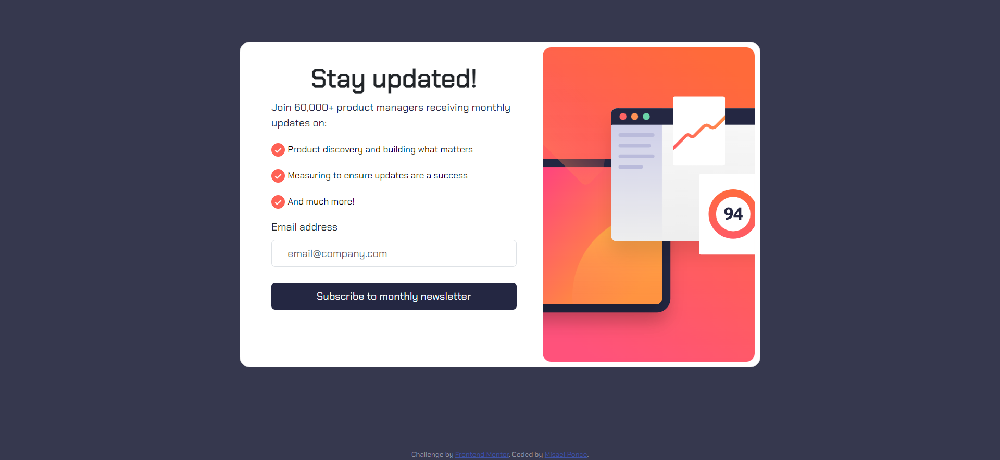

# Frontend Mentor - Newsletter sign-up form with success message solution

This is a solution to the [Newsletter sign-up form with success message challenge on Frontend Mentor](https://www.frontendmentor.io/challenges/newsletter-signup-form-with-success-message-3FC1AZbNrv). 

## Table of contents

- [Overview](#overview)
  - [The challenge](#the-challenge)
  - [Screenshot](#screenshot)
  - [Links](#links)
- [My process](#my-process)
  - [Built with](#built-with)
  - [What I learned](#what-i-learned)
  - [Continued development](#continued-development)
  - [Useful resources](#useful-resources)
- [Author](#author)

## Overview

### The challenge

Users should be able to:

- Add their email and submit the form
- See a success message with their email after successfully submitting the form
- See form validation messages if:
  - The field is left empty
  - The email address is not formatted correctly
- View the optimal layout for the interface depending on their device's screen size
- See hover and focus states for all interactive elements on the page

### Screenshot




### Links

- Solution URL: [-Github Repo](https://github.com/Misaponce/Newsletter-sign-up-form-frontend-mentor)
- Live Site URL: [-Live Site](https://misaponce.github.io/Newsletter-sign-up-form-frontend-mentor/)

## My process

### Built with

- CSS custom properties
- Flexbox
- CSS Grid
- [Bootstrap](https://getbootstrap.com/)

### What I learned

With this challenge I was able to put in practice Bootstrap class to achive the mobile and desktop layout defined on the design example and some basic Js code for the form validation that was quite challenge.


```js
```I discover the method 'toggle' to add a class if it doesn't exist and removes it if it does very usefull```
const toggleCards = () => {
    signUpCard.classList.toggle('d-none');
    successCard.classList.toggle('d-none');
  };
```

### Continued development

I will be developing this same challenge but this time using Reac with TypeScript to improve those skills.

### Useful resources

- [Bootstrap](https://getbootstrap.com/) - This helped me reduce the css code and easier to define a layout. 
- [W3 Schools](https://www.w3schools.com/) - Life changer to find very usefull information.


## Author

- Website - [Misael Ponce](https://portofolio-misaponce.vercel.app/)
- Frontend Mentor - [@Misaponce](https://www.frontendmentor.io/profile/Misaponce)

